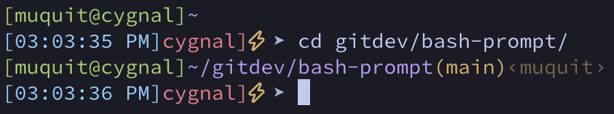

## Table Of Contents
- [Introduction](#introduction)
- [Download and install](#download-and-install)
- [Screenshot](#screenshot)
- [Customization](#customization)
  - [Unicode symbols](#unicode-symbols)
- [Author](#author)
- [See Also](#see-also)

# Introduction
A git aware bash prompt I use. If inside a git repo, it will display git branch 
and git username. It is very helpful if you have multiple github accounts.

# Download and install

* Download the `bash-prompt-v1.0.1.tar.gz` file from [Releases](https://github.com/muquit/bash-prompt/releases) page
* Inspect the content, install script etc. before installing
* List the content
```bash
➤ tar -tvf bash-prompt-v1.0.1.tar.gz
drwxr-xr-x  0 muquit wheel       0 Feb 19 15:23 bash-prompt-v1.0.1/
-rw-r--r--  0 muquit wheel    2013 Feb 19 15:23 bash-prompt-v1.0.1/bash_prompt.sh
-rwxr-xr-x  0 muquit wheel     676 Feb 19 15:23 bash-prompt-v1.0.1/install.sh
-rw-r--r--  0 muquit wheel     804 Feb 19 15:23 bash-prompt-v1.0.1/README.md
-rw-r--r--  0 muquit wheel       7 Feb 19 15:23 bash-prompt-v1.0.1/VERSION
```

* To install, extract the archive and run the install script. Have a look at
the `install.sh` before running it.
```bash
➤ tar -xvf bash-prompt-v1.0.1.tar.gz
➤ cd bash-prompt-v1.0.1
➤ ./install.sh
```
If `~/.bash_prompt.sh` already exists, you will be asked whether to overwrite it.
The install script will append the following to the `~/.bashrc` file if it does not
exist. Do not forget to `source ~/.bashrc` or log out and log back in to see
the prompt.
```bash
# bash-prompt
[[ -f ~/.bash_prompt.sh ]] && source ~/.bash_prompt.sh
```

# Screenshot
Here is a sample prompt.



* The first prompt is not in a git repo; hence there is no git branch or username
* The second prompt is showing **main** is the branch and **muquit** is the username

# Customization
The decoration symbol appears to the left of the `➤` arrow in the prompt. The default is `★ `.
To use a different character, create `~/.bash_prompt_decor.txt` with your preferred Unicode symbol:
```bash
➤ echo "λ" > ~/.bash_prompt_decor.txt
```

I use Unicode symbols  in the prompt to easily identify which system I am
on. Of course your terminal must support Unicode.

Set it to an empty string to disable it:
```bash
➤ echo "" > ~/.bash_prompt_decor.txt
```
## Unicode symbols
[w3schools utf-8 charsets page](https://www.w3schools.com/charsets/) has a list of various unicode symbols.
# Author
This is not my original work. Most of the prompt script was collected from 
the Internet many years ago, with small updates here and there. The one 
addition of my own is the `parse_git_user()` function, written while working 
on [multiple-github-accounts](https://github.com/muquit/multiple-github-accounts).
# See Also
* [multiple-github-accounts](https://github.com/muquit/multiple-github-accounts) - How to use multiple github accounts from a single machine

---
<sub>TOC is created by https://github.com/muquit/markdown-toc-go on Feb-22-2026</sub>
